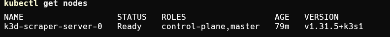
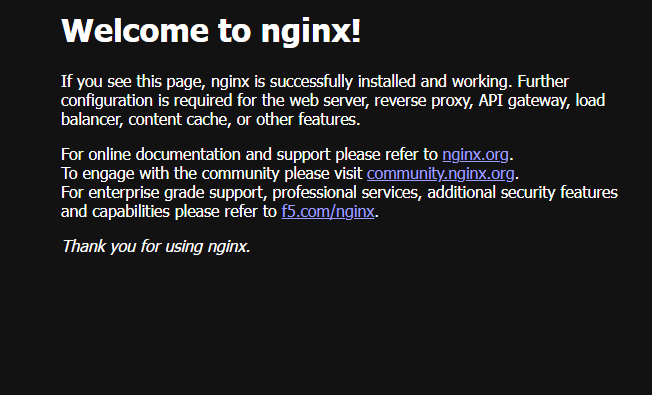
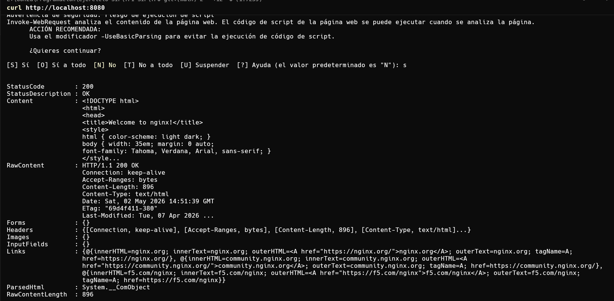
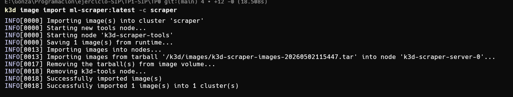

# TP1 SIP — Selenium WebDriver Scraper Multi-Browser — G-ONE

Trabajo práctico de la materia **Seminario de Integración Profesional (SIP)**.
Scraper multi-browser de MercadoLibre Argentina construido de forma incremental con **Java 17** y **Selenium WebDriver 4**.

---

## Integrantes

| Nombre                        | Legajo |
|-------------------------------|--------|
| Roberto Soto                  | 156302 |
| Nicolas Romero                | 195347 |
| Cristian Tomás Anito          | 158887 |
| Rocco Buzzo Marcelo           | 190292 |
| Gonzalo Echeverria Crenna     | 195155 |
| Federico Matias Claros Garcia | 166717 |

---

## Prerrequisitos cumplidos (TP 0)

Checklist obligatorio previo al Hit #7 — evidencia de cada checkpoint:

### 1. `kubectl get nodes` devuelve nodo en Ready



### 2. nginx-test corrió y responde en `curl localhost:8080`




### 3. Sé importar una imagen Docker al cluster

```bash
k3d image import ml-scraper:latest -c scraper
```



### 4. Entiendo Pod, Job, CronJob, ConfigMap y PVC

| Concepto | Para qué sirve |
|---|---|
| **Pod** | Unidad mínima de ejecución en k8s — uno o más containers que comparten red y storage |
| **Job** | Tarea batch que corre hasta completarse una vez (one-off) |
| **CronJob** | Lanza Jobs según una expresión cron (ej: `0 * * * *` = cada hora) |
| **ConfigMap** | Almacena configuración no-sensible (env vars) y la inyecta a los pods sin tocar la imagen |
| **PVC** | Pedido de almacenamiento persistente que sobrevive a reinicios del pod |

---

## Descripción general

El objetivo del TP es construir, hit a hit, un scraper que busque productos en MercadoLibre AR, aplique filtros y extraiga resultados de forma estructurada. Cada hit agrega funcionalidad sobre el anterior.

El sitio elegido presenta los desafíos clásicos del scraping moderno: contenido renderizado por JavaScript, selectores que cambian entre versiones, banners que interceptan clicks, lazy loading y diferencias sutiles entre navegadores.

**Productos objetivo:**
- Bicicleta rodado 29
- iPhone 16 Pro Max
- GeForce RTX 5090

---

## Stack tecnológico

| Tecnología        | Versión                    | Rol                                          |
|-------------------|----------------------------|----------------------------------------------|
| Java              | 17                         | Lenguaje principal                           |
| Selenium WebDriver| 4.20.0                     | Automatización del navegador                 |
| Selenium Manager  | (incluido en Selenium 4)   | Descarga automática de chromedriver/geckodriver |
| Maven             | 3.x                        | Build y gestión de dependencias              |
| Chrome / Firefox  | stable                     | Navegadores objetivo                         |
| JUnit 5           | 5.10.2                     | Framework de testing                         |
| Mockito           | 5.11.0                     | Mocking en tests unitarios                   |
| JaCoCo            | 0.8.12                     | Cobertura de código (mínimo 70 %)            |
| Docker            | multi-stage                | Empaquetado reproducible con browsers incluidos |
| GitHub Actions    | —                          | Pipeline de CI/CD                            |
| pre-commit        | —                          | Hooks locales (gitleaks, checkstyle, spotless)|

---

## Estructura del repositorio

```
TP1-SIP/
├── .github/
│   └── workflows/
│       └── scrape.yml              ← Pipeline CI (gitleaks, unit tests + cobertura, docker)
├── .gitattributes                  ← Normalización a LF para todos los text files
├── .gitignore                      ← Maven target/, IDEs (.idea, .vscode, etc.), salidas, OS
├── .pre-commit-config.yaml         ← Hooks locales pre-commit
├── HIT1/   → Scraper básico con Chrome
├── HIT2/   → Browser Factory (Chrome y Firefox)
├── HIT3/   → Filtros por DOM + Screenshot
├── HIT4/   → Extracción multi-producto y JSON
├── HIT5/   → Robustez, reintentos y módulo Selectors
├── HIT6/
│   ├── checkstyle.xml              ← Reglas de estilo Java
│   ├── Dockerfile                  ← Multi-stage: builder + runtime con Chrome y Firefox
│   ├── docker-compose.yml          ← Servicios: scraper, lint, test
│   ├── docker-entrypoint.sh        ← Manejo de --browser y HEADLESS al iniciar el contenedor
│   ├── pom.xml
│   └── src/
│       ├── main/java/ar/edu/sip/
│       │   ├── BrowserFactory.java
│       │   ├── MercadoLibreScraper.java
│       │   ├── ProductResult.java
│       │   └── Selectors.java
│       └── test/java/ar/edu/sip/
│           ├── BrowserFactoryTest.java
│           ├── MercadoLibreScrapperTest.java
│           └── ProductResultSchemaTest.java
├── HIT7/   → Orquestación con Kubernetes (k3s Job + CronJob + ConfigMap + PVC)
│   └── k8s/                    ← Manifiestos Kubernetes (ConfigMap, PVC, Job, CronJob)
├── HIT8/   → Capacidad extendida (paginación 30 resultados, stats precio, PostgreSQL)
│   ├── k8s/                    ← PostgreSQL StatefulSet + Secret + Job/CronJob actualizados
│   └── src/main/resources/db/migration/  ← Migraciones Flyway
└── docs/
    └── adr/                       ← Architecture Decision Records
        ├── 0000-template.md
        ├── 0001-framework-automatizacion.md
        ├── 0002-estrategia-selectores.md
        ├── 0003-stack-java-maven.md
        ├── 0004-pre-commit-vs-ci.md
        └── 0005-orquestacion-kubernetes.md
```

---

## Requisitos previos

- Java 17 o superior
- Maven 3.6 o superior
- Docker Desktop (o Docker Engine en Linux)
- Google Chrome y/o Mozilla Firefox instalados (solo para correr el scraper localmente sin Docker)
- Python 3.8+ y `pip` (solo para activar pre-commit hooks)
- Conexión a internet (Selenium Manager descarga los drivers la primera vez)

---

## Hits implementados

> [!NOTE]
> HIT6 y HIT8 tienen Spotless + Checkstyle configurados. Antes de pushear cambios, correr desde la carpeta correspondiente:
> ```bash
> mvn spotless:apply        # auto-formatea con google-java-format
> mvn clean verify          # corre Checkstyle, tests, JaCoCo (≥70%)
> ```
> Si tenés `pre-commit` instalado, ambos se disparan automáticamente en cada `git commit`.

### HIT 1 — Scraper básico con Chrome
**Carpeta:** `HIT1/`

Abre Chrome, navega a MercadoLibre AR, busca **"bicicleta rodado 29"** y muestra los títulos de los primeros 5 resultados. Toda la sincronización usa `WebDriverWait` + `ExpectedConditions`. Prohibido `Thread.sleep()`.

```bash
cd HIT1
mvn compile exec:java
```

---

### HIT 2 — Browser Factory
**Carpeta:** `HIT2/`

Refactorización del HIT1 que introduce una clase `BrowserFactory`. Recibe el nombre del navegador (`chrome` o `firefox`) y devuelve una instancia de `WebDriver` correctamente configurada. El navegador se elige por system property o variable de entorno sin tocar el código.

```bash
cd HIT2
mvn compile exec:java                     # Chrome (default)
mvn compile exec:java -Dbrowser=firefox   # Firefox
```

Cadena de resolución del navegador:
```
argumento directo → -Dbrowser → $BROWSER → "chrome"
```

---

### HIT 3 — Filtros por DOM y Screenshot
**Carpeta:** `HIT3/`

Aplica tres filtros sobre la página de resultados interactuando con el DOM (clicks reales, no modificación de URL):

- **Condición:** Nuevo
- **Tienda:** Solo tiendas oficiales
- **Orden:** Más relevantes

Además captura un screenshot de la página filtrada y lo guarda en `HIT3/screenshots/<producto>_<browser>.png`.

```bash
cd HIT3
mvn compile exec:java
mvn compile exec:java -Dbrowser=firefox
```

---

### HIT 4 — Extracción multi-producto y JSON
**Carpeta:** `HIT4/`

Generaliza el scraper para procesar los tres productos objetivo en una misma ejecución y guardar los resultados en archivos JSON estructurados.

**Campos extraídos por ítem:** `titulo`, `precio` (Long ARS), `link`, `tienda_oficial`, `envio_gratis`, `cuotas_sin_interes`.

```bash
cd HIT4
mvn compile exec:java                     # Chrome (default)
mvn compile exec:java -Dbrowser=firefox   # Firefox
```

Los JSONs se generan en `HIT4/output/<producto>.json` y los screenshots en `HIT4/screenshots/`.

---

### HIT 5 — Robustez, reintentos y módulo Selectors
**Carpeta:** `HIT5/`

Incorpora manejo de errores granular y un módulo centralizado de selectores.

- **`Selectors.java`**: todos los selectores CSS/XPath en una sola clase; actualizarlos ante cambios de layout de MercadoLibre no requiere tocar la lógica de negocio.
- **Reintentos automáticos**: hasta 3 intentos por producto ante cualquier excepción, sin `Thread.sleep()`.
- **Helpers `tryGetText` / `tryGetLong`**: campos opcionales retornan `null` en vez de propagar `NoSuchElementException`.

```bash
cd HIT5
mvn compile exec:java                     # Chrome (default)
mvn compile exec:java -Dbrowser=firefox   # Firefox
```

---

### HIT 6 — Headless, Tests Automatizados, Docker y CI
**Carpeta:** `HIT6/`

#### Modo headless

El modo headless se controla por variable de entorno o system property sin tocar el código:

```bash
cd HIT6

# Modo headless (sin abrir ventana)
HEADLESS=true mvn exec:java

# Modo visible (útil para debug)
HEADLESS=false mvn exec:java
```

Cadena de resolución:
```
-Dheadless → $HEADLESS → false (default)
```

---

#### Tests unitarios (sin browser)

Usan Mockito para simular `WebDriver` y `WebElement`. No abren ningún browser, corren en milisegundos. Validan los 4 criterios del hit (≥10 resultados, schema mínimo, precios positivos, links absolutos) más el resto de la lógica del scraper.

| Archivo | Qué cubre |
|---|---|
| `BrowserFactoryTest` | Resolución de browser/headless por property/env, fallback a default, instanciación de drivers |
| `MercadoLibreScrapperTest` | `extraerDatos`, `tryGetText`, `tryGetLong`, `sanitizar`, retries, banner, filtros, orden, screenshot |
| `ProductResultSchemaTest` | Schema mínimo del JSON, anotaciones `@JsonProperty`, tipos correctos |

```bash
cd HIT6
mvn test
```

Cobertura mínima configurada: **70 %** (JaCoCo falla el build si cae debajo). Cobertura actual: ~80 %.
El reporte HTML se genera en `HIT6/target/site/jacoco/index.html`.

```bash
# Generar reporte de cobertura
cd HIT6
mvn verify

# Abrir reporte (Linux)
xdg-open target/site/jacoco/index.html

# Abrir reporte (macOS)
open target/site/jacoco/index.html
```

---

#### Docker

La imagen es multi-stage:

- Stage **`builder`**: compila con Maven 3.9.6 + JDK 17 (`maven:3.9.6-eclipse-temurin-17`) y empaqueta un fat jar con `maven-shade-plugin` (incluye Selenium + Jackson + `Main-Class` declarado).
- Stage **`runtime`**: imagen mínima con JRE 17 (`eclipse-temurin:17.0.11_9-jre-jammy`) + **Google Chrome stable** (repo APT oficial de Google) + **Firefox** (repo APT oficial de Mozilla en `packages.mozilla.org`).

Las **bases están pinneadas** por digest. Los browsers usan los repos APT oficiales — versión actual estable; los **drivers (`chromedriver`, `geckodriver`) los resuelve Selenium Manager en runtime** contra la versión exacta del browser instalado, evitando el problema de version-matching.

**Construir la imagen:**
```bash
cd HIT6
docker build -t ml-scraper:latest .
```

**Correr el scraper con Docker:**
```bash
# Chrome (default)
docker run --rm \
  -v $(pwd)/output:/app/output \
  -v $(pwd)/screenshots:/app/screenshots \
  ml-scraper:latest

# Firefox
docker run --rm \
  -v $(pwd)/output:/app/output \
  -v $(pwd)/screenshots:/app/screenshots \
  ml-scraper:latest --browser firefox

# Modo visible (requiere display virtual en Linux)
docker run --rm \
  -e HEADLESS=false \
  -v $(pwd)/output:/app/output \
  ml-scraper:latest
```

**Con Docker Compose:**
```bash
cd HIT6

# Chrome headless (default)
docker compose up scraper

# Firefox
BROWSER=firefox docker compose up scraper

# Lint (Checkstyle + Spotless, sin instalar nada local)
docker compose run --rm lint

# Tests unitarios + cobertura dentro del contenedor
docker compose run --rm test
```

Los JSONs generados quedan en `HIT6/output/` y los screenshots en `HIT6/screenshots/`, montados desde el host.

---

#### Pipeline CI (GitHub Actions)

El workflow `.github/workflows/scrape.yml` corre automáticamente en cada push y pull request. La secuencia de jobs es:

```
secrets-scan
    ├── unit-tests HIT6 (chrome/firefox) ──┬── k8s-validate (HIT7+HIT8) ──┬── publish-image HIT6  (solo main)
    │                                       │                               └── publish-image HIT8  (solo main)
    │                                       └── docker-scraper HIT6 (chrome/firefox)
    └── unit-tests HIT8 (chrome/firefox) ──┘
```

| Job | Qué hace | Cuándo corre |
|---|---|---|
| `secrets-scan` | Gitleaks sobre todo el historial | Siempre |
| `unit-tests` | `mvn verify` HIT6 + JaCoCo ≥ 70 % en matriz chrome/firefox | Siempre |
| `unit-tests-hit8` | `mvn verify` HIT8 + JaCoCo ≥ 70 % en matriz chrome/firefox | Siempre |
| `k8s-validate` | kubeconform sobre YAMLs de HIT7 y HIT8 | Si unit-tests pasa |
| `docker-scraper` | `docker build` + `docker run` headless HIT6 en matriz chrome/firefox | Si unit-tests pasa |
| `publish-image` | Publica `ml-scraper` (HIT6) en `ghcr.io/gonzaec/ml-scraper` | Solo en push a `main` |
| `publish-image-hit8` | Publica `ml-scraper-hit8` en `ghcr.io/gonzaec/ml-scraper-hit8` | Solo en push a `main` |

**Artifacts publicados por el pipeline:**
- `jacoco-report-{browser}` — reporte HTML de cobertura (14 días)
- `surefire-results-{browser}` — XML de resultados de tests (7 días)
- `output-json-docker-{browser}` — JSONs generados por el scraper en Docker (7 días)
- `screenshots-docker-{browser}` — screenshots del scraper en Docker (7 días)

> [!NOTE]
> El job `docker-scraper` puede fallar en **Firefox** (artefactos vacíos) porque MercadoLibre bloquea sesiones de Geckodriver desde IPs de datacenter redirigiendo a una página de verificación de cuenta. Chrome evade este bloqueo gracias a flags extra de anti-detección (`--disable-blink-features=AutomationControlled`, `--headless=new`). El job tiene `continue-on-error: true` para que no rompa el pipeline — es comportamiento esperado. Ver [ADR 0006](docs/adr/0006-deteccion-anti-bot-chrome-vs-firefox.md) para el análisis técnico.

---

#### Pre-commit hooks locales

Los hooks se ejecutan automáticamente antes de cada `git commit` y bloquean el push si detectan problemas. Requieren Python.

**Instalación (una sola vez por clon):**
```bash
pip install pre-commit
pre-commit install
```

**Hooks configurados:**

| Hook | Qué valida |
|---|---|
| `gitleaks` | Secrets hardcodeados (tokens, passwords, keys) |
| `trailing-whitespace` | Espacios al final de línea |
| `end-of-file-fixer` | Newline al final de cada archivo |
| `mixed-line-ending` | Normaliza CRLF → LF |
| `check-merge-conflict` | Markers de merge sin resolver |
| `check-yaml` | Sintaxis de YAML |
| `check-added-large-files` | Bloquea archivos > 1 MB |
| `spotless-apply` | Formato Java (auto-fix con Google Java Format) |
| `checkstyle` | Estilo Java (nombres, llaves, imports) |

**Ejecución manual sobre todos los archivos:**
```bash
pre-commit run --all-files
```

**Saltear hooks puntualmente (no recomendado):**
```bash
git commit --no-verify -m "mensaje"
```

---

### HIT 7 — Despliegue en Kubernetes (k3s)
**Carpeta:** `HIT7/`, manifiestos en `HIT7/k8s/`

Orquesta el scraper en un cluster k3s/k3d usando recursos nativos de Kubernetes para batch processing:

- **ConfigMap** (`HIT7/k8s/configmap.yaml`): externaliza `BROWSER`, `HEADLESS`, `LOG_LEVEL` y la lista de `PRODUCTS`.
- **PVC** (`HIT7/k8s/pvc.yaml`): solicita 1 GB con `storageClassName: local-path` (viene en k3s).
- **Job** (`HIT7/k8s/job.yaml`): ejecuta el scraper **una vez** y persiste outputs.
- **CronJob** (`HIT7/k8s/cronjob.yaml`): ejecuta el scraper **cada hora** (`0 * * * *`).

La imagen Docker está publicada en GitHub Container Registry y es descargada automáticamente por el cluster:

```bash
# La imagen se descarga sola — no hace falta docker build ni image import
kubectl apply -f HIT7/k8s/
kubectl logs -l job-name=scraper-once -f
kubectl get cronjobs
```

El pipeline de CI publica automáticamente una nueva versión de la imagen en cada push a `main`.

Documentación completa (setup del cluster, troubleshooting, limpieza) en [`HIT7/README.md`](HIT7/README.md).

---

### HIT 8 — Capacidad Extendida
**Carpeta:** `HIT8/`, manifiestos en `HIT8/k8s/`

Extiende el scraper con tres capacidades nuevas:

#### 1. Paginación
El scraper navega hasta **3 páginas** recolectando **10 ítems por página**, llegando a **30 resultados por producto**.

```java
static final int CANT_RESULTADOS = 30;
static final int CANT_POR_PAGINA = 10;
static final int MAX_PAGINAS     = 3;
```

#### 2. Estadísticas de precio
Después de cada búsqueda se calculan y muestran: **mínimo, máximo, mediana y desvío estándar** de los precios obtenidos.

```
[STATS] iPhone 16 Pro Max
  iPhone 16 Pro Max              | min=1.200.000 | max=2.800.000 | mediana=1.850.000 | σ=380.000 | n=27
```

#### 3. Histórico en PostgreSQL
Los resultados y estadísticas se guardan en PostgreSQL desplegado como **StatefulSet** en k3s:

- Credenciales inyectadas por **Secret** (`POSTGRES_PASSWORD`)
- Variables de configuración por **ConfigMap** (`POSTGRES_HOST`, `POSTGRES_DB`, etc.)
- Esquema creado por **Flyway** al primer arranque
- Un **initContainer** garantiza que PostgreSQL esté listo antes de arrancar el scraper

```bash
kubectl apply -f HIT8/k8s/
kubectl logs -l job-name=scraper-once -f

# Consultar resultados
kubectl port-forward svc/postgres 5432:5432
psql -h localhost -U scraper -d scraper -c "SELECT COUNT(*) FROM scrape_results;"
```

> Si `POSTGRES_HOST` no está configurado, el scraper sigue funcionando normalmente y guarda solo el JSON.

Documentación completa en [`HIT8/README.md`](HIT8/README.md).

---

## Principios de implementación

### Explicit waits — sin Thread.sleep()

Toda la sincronización usa `WebDriverWait` con condiciones específicas:

| Condición | Uso |
|---|---|
| `elementToBeClickable` | Antes de escribir en campos o hacer click en botones |
| `presenceOfElementLocated` | Confirmar que los resultados cargaron en el DOM |
| `visibilityOfElementLocated` | Esperar que elementos ocultos se vuelvan visibles |
| `invisibilityOfElementLocated` | Confirmar que el banner de cookies desapareció |

### Selectores con fallback

MercadoLibre cambia su HTML con frecuencia. Los selectores de títulos se definen como una lista ordenada; el código prueba cada uno hasta encontrar el primero que devuelva elementos con texto:

```java
private static final String[] SELECTORES_TITULO = {
    "a.poly-component__title",       // layout poly (2024-2025)
    "h2.poly-box a",
    ".ui-search-item__title",
    "li.ui-search-layout__item h2 a",
    "a.ui-search-link__title-card"
};
```

### JS click para overlays

Cuando un overlay (banner de cookies, header sticky, dropdown abierto) tapa el elemento objetivo, Selenium lanza `ElementClickInterceptedException` con el click nativo. Se resuelve con:

```java
((JavascriptExecutor) driver).executeScript("arguments[0].click();", elemento);
```

### Selenium Manager

Selenium 4 incluye Selenium Manager, un binario que detecta la versión del navegador instalado y descarga el driver correcto (`chromedriver`, `geckodriver`) automáticamente. No se necesita configuración manual ni dependencias adicionales de driver.

---

## Diferencias entre Chrome y Firefox

| Aspecto | Chrome | Firefox |
|---|---|---|
| Protocolo de inspección | CDP (Chrome DevTools Protocol) | WebDriver BiDi |
| Warning de versión | Sí (`Unable to find CDP matching 147`) | No |
| Clase de opciones | `ChromeOptions` | `FirefoxOptions` |
| Suprimir detección WebDriver | `--disable-blink-features=AutomationControlled` | `dom.webdriver.enabled = false` |
| Selectores CSS en resultados | Idénticos (mismo HTML del servidor) | Idénticos |
| Tiempo de arranque | Más rápido | Más lento (primer uso descarga geckodriver) |
